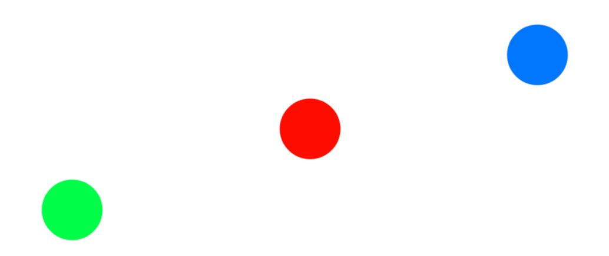
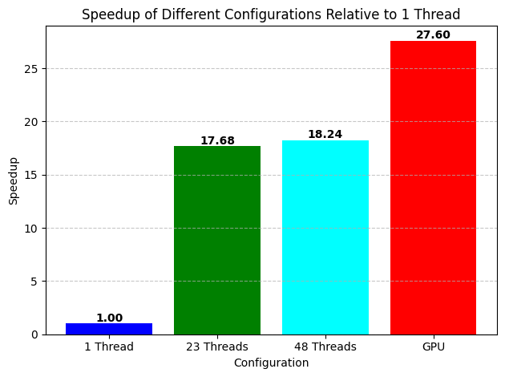

# OpenMP and OpenACC N-Body simulation with GPU acceleration




> The following is a project made for the High Performance Computation course of Master 2 CompuPhys at the Unviersity of Franche-Comté. 

Please report to the following [report](./Léo%20Bechet%20N-Body%20HPC%20report.pdf) for more explanations.


## Demo

A python script called `main.py` can be found inside the `program` folder. Executing it will  display a demo menu for the code. Multiple options are available to fine tune your experience.

## Advanced usage

### Loading initial data

Data must be raw dumps, usually from numpy. Below, an example on how to create a sphere 

```python
import numpy as np

n_stars = 3000
tallness = 1 #galaxy sim shennanigans

def generate_points_sphere(n_points):
    points = []
    while len(points) < n_points:
        x, y, z = np.random.uniform(-radius, radius, 3)
        if x**2 + y**2 + z**2 <= radius**2:
            points.append([x, y, z])
    return points

def generate_velocity(pos_data, omega_z=1):
    x, y, z = pos_data[:, 0], pos_data[:, 1], pos_data[:, 2]
    vx = -omega_z * y
    vy = omega_z * x
    vz = np.zeros_like(z)  
    velocities = np.column_stack((vx, vy, vz))
    return velocities

pos_data = np.array(generate_points_sphere(n_stars))
pos_data.T.tofile('positions.dat')
vel_data = generate_velocity(pos_data)
vel_data.T.tofile('velocities.dat')
```

### Using the code

#### OpenMP/CPU compilation
Compilation is usually done using the following `gfortran -O3 -fopenmp -o out.o sim.f90`. Please feel free to adapt it to your usage.

#### OpenACC/GPU compilation
Compilation is usually done using the following `pgfortran -O3 -gpu=cc75 -acc -o out.o sim.f90`. Please feel free to adapt it to your usage.

#### Running a simulation

Please make sure the following is properly setup :

Files :
The following files must be present. You can change their names and path in the source fortran code.
- `positions.dat` : Initial positions
- `velocities.dat` : Initial velocities

Settings :
Please set the corresponding parameters inside the Fortran source code.
- `n_stars` : The number of stars in the initial files. A wrong value can break the loading of the data, resulting in positions and velocities to be totally wrong.
- `do_V` : Switch to enable outputting the velocities.
- `do_E` : Switch to enable outputting the potential and kinetic energies.
- `save_last_V` : If enabled, the velocities will be dumped at the end of the simulation.

Other settings can also be modified, such as the time step `dt`, the  `number_of_steps`, the `mass`


##### Plotting the data

###### Energy
It is possible to plot the evolution of the energy. Below is a sample script :

```python
import numpy as np
import matplotlib.pyplot as plt

data = np.loadtxt('energy.dat')

potential_energy = data[:, 0]
kinetic_energy = data[:, 1]

total_energy = kinetic_energy + potential_energy
plt.figure(figsize=(10, 6))

plt.plot(kinetic_energy, label='Kinetic Energy', color='blue')
plt.plot(potential_energy, label='Potential Energy', color='red')
plt.plot(total_energy, label='Total Energy', color='green', linestyle='--')

plt.xlabel('Time Step (T)')
plt.ylabel('Energy')
plt.title('Kinetic, Potential, and Total Energy vs Time')
plt.legend()

plt.grid(True)
plt.show()
```

##### Animation of the simulation

A sample plotting script is available in the `program` folder, which is a modified (data loading) version of Barnabé DEFORET's code.

## Additional notes

Multiple development versions are available in the `development` folder


### Array index switching

We currently have unresolved issues with loading the data when switching the indices of the array. However, the simulation is working as expected. For this reason the available code does not include the array index switch optimization. Benchmarks have been done, and the  

### Speedup



Done on a 48T CPU. Issue with multithreading past 23T may be present, thus the 23/48 small difference. GPU done with FP64 precision.


